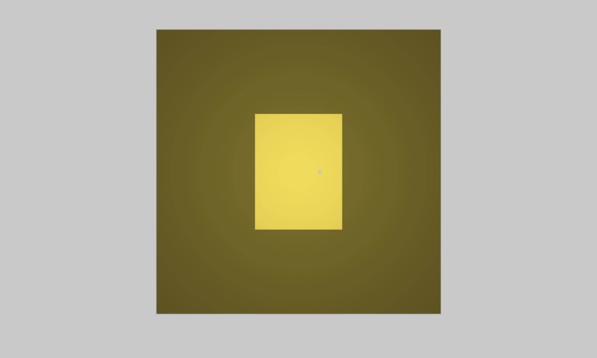

# Linear Patch Antenna

- This page contains the schematic, PCB layout, and HFSS simulation files for a linearly polarized patch antenna I designed, centered at 2245 MHz designed for testing purposes for UTAT (University of Toronto Aerospace Team)
- It features a coaxial probe feed into the board
- Substrate chosen is FR4 (1.6mm board thickness) since this is a low cost testing prototype

## PCB Layout

## S-Parameter Results

